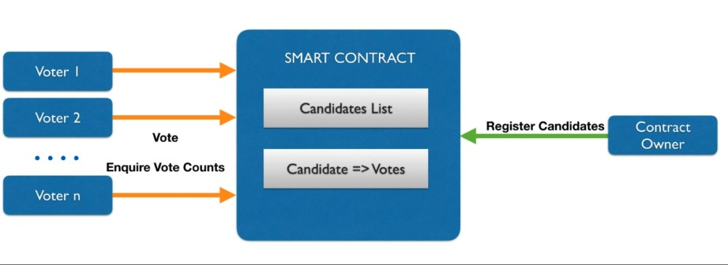

## Voting Contract 

Create a smart contract for Voting. Only Contract owner should be able to register the candidates. Anyone can vote for any of the registered candidates. Contract should make sure that the vote is registered only against registered candidate. Lastly, anyone can check who is winner or leading the election.  

